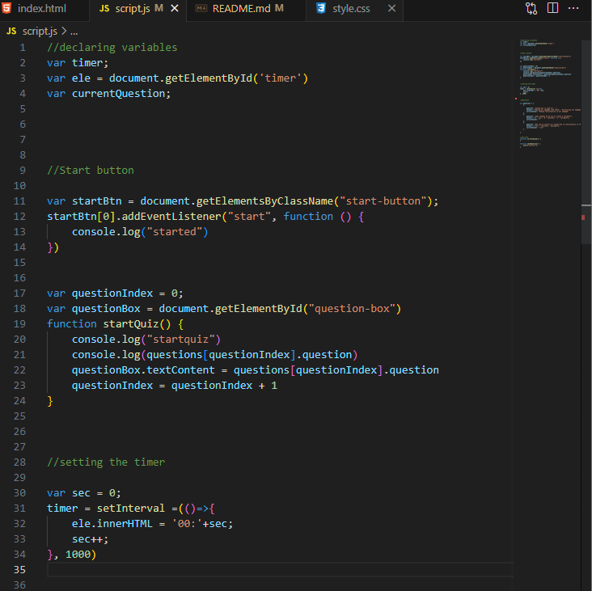

# WebAPI-Code-Quiz

## Description

For this project, I attempted to create a JavaScript quiz with a timer and corresponding questions. 

## Installation 

1. From the "Code-Refactor" repository (https://github.com/RG-GitUser/Code-Refactor) select the "Code" dropdown.
2. Using the "Code" dropdown, click on "SSH".
3. On the "SSH" tab, select the "copy" button next to  the address.
4. Next, open your git bash terminal (or for mac users, homebrew)
5. Use the command "git clone" and "insert coppied SSH key here" then press enter. 
6. Enter the "cd "enter path here" " command to navigate to the correct directory. 
7. You now have the repository cloned to your system! To verify, the command "ls" to view the items listed inside of the repository. 

## Usage 

As a user, you're to try your luck at the quiz to help extened your knowledge in JavaScript. 

Screenshot sample of code used: 

 

## Credits

devdocs.io: https://devdocs.io/

stackoverflow: https://stackoverflow.com/

